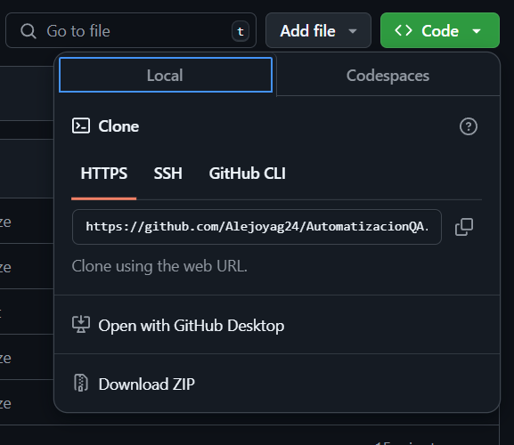
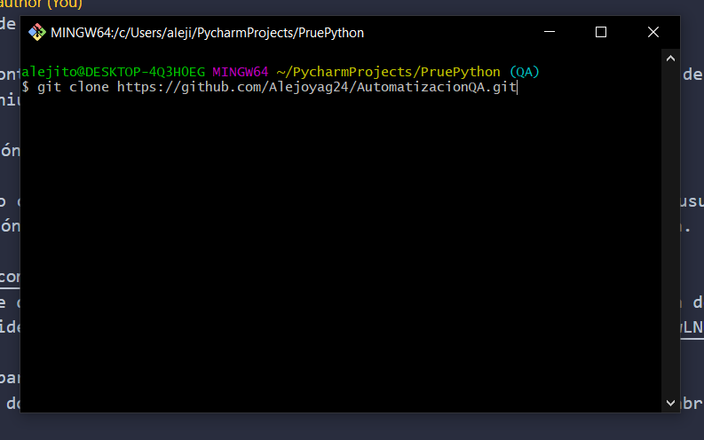
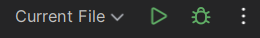

Automatización de Pruebas con Selenium

Este proyecto contiene pruebas automatizadas para el sistema de registro e inicio de sesión en la plataforma Inlaze - QA Test,
utilizando Selenium con Python.

1. Descripción del Proyecto

Este repositorio contiene scripts de automatización que permiten: Registrar un usuario nuevo en la plataforma.
Iniciar sesión con un usuario registrado. Cerrar sesión de manera automática.

https://github.com/Alejoyag24/AutomatizacionQA/tree/QA
est es el enlace donde se encuentra todo la prueba con los pasos solicitados, para descargar utilice estos comando en git si no tiene
git mire este video en YouTube y descarguelo https://www.youtube.com/watch?v=jdXKwLNUfmg

comando a usar para clonar la prueba
elegir un lugar donde abrir git, dar clic derecho y seleccionar git bash here se abrira una consola.

digitar git clone y en el enlace de git lo abren y buscan la rama de QA luego en un boton verde a la derecha esta CODE lo seleccionan
utilizan Https lo copian y lo pegan en la consola de git justo con este comando git clone https://github.com/Alejoyag24/AutomatizacionQA.git
,  le dan enter y se les clonara o descargara la prueba.

para abrirlo o ejecutarlo deben de tener instalado en el computador Pycharm si no lo tienen instalado, en este video de YouTubelo explican
https://www.youtube.com/watch?v=dJjPq2xlLcQ

una vez lo tengan instalado lo abren y buscan la parte de abrir proyecyo seleccionan la prueba en la carpera o en la ubicacion donde lo descargaron
y una vez lo tengan instalan el WebDriver con la direccion exacta para que funcione y listo en la parte de Main.py digitan los datos que quieran probar en la pagina
y lo ejecutan en laparte superior derecha que esta entre Current File y un icono de bicho 

Estructura del Proyecto

proyecto-selenium
 base.py          # Clase base que inicializa el WebDriver
registro.py      # Automatización del registro de usuarios
login.py         # Automatización del inicio de sesión
main.py          # Script principal que ejecuta las pruebas
README.md        # Documentación del proyecto
drivers/         # Rar donde se encuentra ChromeDriver
2. Descripción de las Clases

1. Base (base.py)

Función: Clase Main que inicializa el navegador (WebDriver) y gestiona la navegación.
Cómo funciona:

Abre el navegador y accede a la página de prueba.

Se reutiliza en las clases Login y Registro.

2. Registro (registro.py)

Función: Automatiza el proceso de registro en la plataforma.
Cómo funciona:

Llena los campos de nombre, email, contraseña.

Realiza validaciones de los datos ingresados.

Hace clic en el botón de registro.

3. Login (login.py)

Función: Automatiza el inicio de sesión en la plataforma.
Cómo funciona:

Llena los campos de email y contraseña.

Hace clic en el botón de login.

Permite cerrar sesión después de iniciar sesión.

4. Main (main.py)

Función: Ejecuta las pruebas en orden:

Primero, registra un usuario.

Luego, inicia sesión con ese usuario.

Finalmente, cierra sesión.

3. Instalación y Configuración

Paso 1: Instalar Python y Selenium

Instalar Python 3.8+ desde: https://www.python.org/downloads/

Instalar Selenium con:

pip install selenium

Paso 2: Descargar ChromeDriver

Para ejecutar Selenium, necesitas ChromeDriver, que debe coincidir con la versión de Google Chrome instalada.

Cómo verificar tu versión de Chrome:En Google Chrome, ve a:

Configuración → Información de Chrome → Versión

Ejemplo: Versión 122.0.6261.94

Descargar ChromeDriver correspondiente:

Ir a: https://chromedriver.chromium.org/downloads

Seleccionar la versión compatible con tu Chrome.

Extraer el archivo y moverlo a la carpeta del proyecto.

4. Cómo Ejecutar los Scripts de Automatización

Ejecutar todo el flujo (Registro + Login)

python main.py

Ejecutar solo la prueba de Registro

python registro.py

Ejecutar solo la prueba de Login

python login.py

Notion casos de pruebas y reporte de bugs:

https://lopsided-son-de5.notion.site/Casos-de-Pruebas-1690457b207e8072b517dc14c8dc7f01